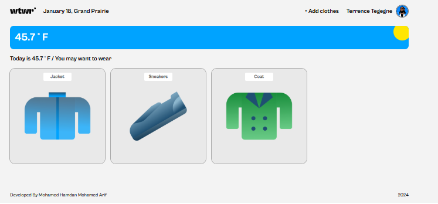
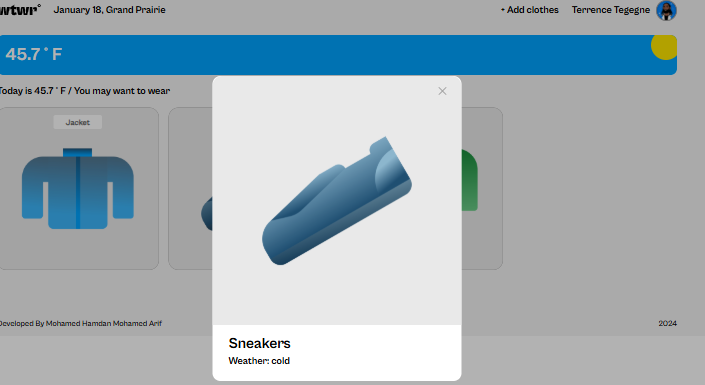
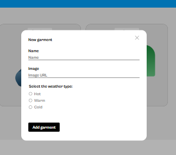

# WTWR (What to Wear?) - Backend

The WTWR app is a react-based application that helps users decide what to wear based on the current weather in their location. The app combines dynamic weather data with an intuitive interface to provide a seamless and adaptive user experience.

## Features

### Dynamic Weather Integration

- Retrieves real-time weather data using weather API.
- Displays the current temperature and location.

### Adaptive Clothing Recommendations

- Shows a collection of clothing items based on the current weather.
- Filters clothing cards dynamically according to temperature.

### Tech Stack

- **Node.js**: Runtime environment that allows you to execute JavaScript outside of a web browser.
- **Express.js**: Web framework for building API.
- **MongoDB**: Database for storing user data and preferences.
- **RESTful API**: An architectural style for an API that uses HTTP request to access and use data.
- **Postman**: Allows developers to test, document, and share APIs.

### Images

### Deployment

- [Github Link](https://github.com/MdHamdan-13/se_project_express.git)
